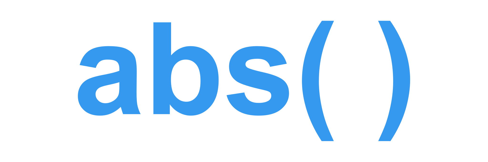

<div align="center">
  
</div>

---

*abs()* - Automatisierte Bewertung von Straßen - ermittelt mit Methoden künstlicher Intelligenz den Zustand von Straßen
und Straßenmarkierungen.  
Dazu werden aus einem digitalen Zwilling der Straße, bestehend aus Panoramas und Punktwolken, Daten extrahiert,
klassifiziert und bewertet.
Diese können anschließend als Planungsgrundlage für das kommunale Instandhaltungsmanagement der Straßen genutzt werden.

*abs()* ist im Rahmen einer Auftragsforschung kommunaler Partner entstanden und wurde von der
[Westfälischen Hochschule Gelsenkirchen](https://w-hs.de) entwickelt.  
Die kommunalen Partner waren der Kreis Recklinghausen und die Städte Bocholt, Bottrop, Dorsten, Gelsenkirchen,
Haltern, Herten, Marl und Recklinghausen.

Die Software basiert auf Vorarbeiten aus dem [GeoSmartChange-Projekt](https://www.gelsenkirchen.de/de/Stadtprofil/Stadtthemen/Die_vernetzte_Stadt/Leitthemen_und_Projekte/Digitale_und_Buergerorientierte_Verwaltung/GeoSmartChange.aspx).

- [Installation](#installation)
- [Verwendung](#verwendung)
  - [Benötigte Daten](#benoetigte-daten)
    - [Panoramas](#panoramas)
    - [Punktwolken](#punktwolken)
    - [Aggregationsflächen](#aggregationsflaechen)
  - [Konfigurationsdatei](#konfigurationsdatei)
  - [Starten der Software](#starten-der-software)
  - [Erneute Bewertung](#erneute-bewertung)
- [Ergebnisse](#ergebnisse)
  - [done.txt](#donetxt)
  - [Geodaten](#geodaten)
    - [Straßenzustand](#strassenzustand)
    - [Substanz](#substanz)
    - [Straßenmarkierungen](#strassenmarkierungen)
  - [Orthos](#orthos)
    - [RGB](#rgb)
    - [Intensity](#intensity-und-height)
    - [Height](#intensity-und-height)
- [Kontakt](#kontakt)

# Installation

**Hardwarevoraussetzungen:** CPU mit mind. 8 Kernen und mind. 8GB RAM

Installieren Sie zunächst [Docker](https://docker.com/products/docker-desktop).  
Laden Sie anschließend das [*abs()* Dockerfile](Dockerfile) herunter.  
Erstellen Sie nun das *abs()* Image.

```
docker build -f </Pfad/zu/Dockerfile> -t abs .
```

**HINWEIS:** Das Parent Image ist das [python:3.8-slim-bullseye](https://hub.docker.com/_/python)
Image.
Die entsprechenden Lizenzbedingungen sind [hier](https://hub.docker.com/_/python) zu entnehmen.

# Verwendung

## <a id="benoetigte-daten"></a> Benötigte Daten

Als Eingangsdaten werden Panoramas mit zusätzlichen Metadaten sowie LiDAR-Punktwolken benötigt.
Zudem müssen Aggregationsflächen zur Bewertung vorliegen.

### Panoramas

- Die Panoramas müssen als `.png`- oder `.jpg`-Dateien vorliegen
- Sie müssen 360° in der Horizontalen und 180° in der Vertikalen abbilden (Rektangularprojektion)
- Jedem Panorama muss eine fortlaufende ID zugeordnet sein
- Die Panoramas müssen entweder in Richtung Norden oder in Fahrtrichtung des Aufnahmefahrzeugs
ausgerichtet sein (relativ zu geografischem Norden oder Gitter-Norden)
- Es müssen Geodaten (`.shp`- oder `.gpkg`-Datei) vorliegen, in denen jedes Panorama durch eine Punktgeometrie
abgebildet wird, welche ID, Aufnahmezeitpunkt, -richtung, -höhe und optional den
Pfad zum Panorama und den Pfad zu einer Maske des Aufnahmefahrzeugs als
Felder enthält
- Enthalten die Geodaten keine Informationen über den Pfad, müssen die Panoramas mit ihren IDs als
Dateinamen benannt sein und sich in Unterverzeichnissen befinden, welche nach den ersten 6 Zeichen
der ID benannt sind (*Cyclomedia*)

Weitere Informationen finden Sie in der [Dokumentation der Konfigurationsdatei](docs/docs_config.md#panoramas).

### Punktwolken

- Die Punktwolken müssen als `.las`- oder `.laz`-Dateien vorliegen
- Alle Punktwolken müssen sich in einem einzigen Verzeichnis befinden
- Jede Punktwolke muss einen quadratischen Bereich abbilden, welcher eine für alle identische,
ganzzahlige Größe in Metern besitzt
- Die Koordinaten der südwestlichen Ecke des Bereichs müssen sich im Dateinamen wiederfinden
- Die Koordinaten können entweder direkt oder geteilt durch die Größe des Bereichs im 
Namen vorkommen (*Cyclomedia*)

Weitere Informationen finden Sie in der [Dokumentation der Konfigurationsdatei](docs/docs_config.md#punktwolken).

### <a id="aggregationsflaechen"></a> Aggregationsflächen

- Die Aggregationsflächen müssen als `.shp`- oder `.gpkg`-Datei vorliegen
- Die Geodaten dürfen ausschließlich Polygon-Geometrien enthalten
- Jede Geometrie benötigt die Felder `FK` und `BW`
- Das Feld `FK` (Funktionsklasse) muss einen der folgenden Werte enthalten: `A` (Hauptverkehrsstraße),
`B` (Nebenstraße), `N` (Nebenfläche)
- Das Feld `BW` (Bauweise) muss einen der folgenden Werte enthalten: `A` (Asphalt), `P` (Pflaster/ Platten)
- Die Aggregationsflächen dürfen beliebige weitere Felder enthalten

Weitere Informationen finden Sie in der [Dokumentation der Konfigurationsdatei](docs/docs_config.md#aggregationsflaechen).

---

## Konfigurationsdatei

Die Parameter der Software werden in einer Konfigurationsdatei spezifiziert.  
Die Konfigurationsdatei ist in der [Dokumentation der Konfigurationsdatei](docs/docs_config.md) beschrieben.

---

## Starten der Software

Führen Sie folgenden Befehl zum Starten der Software aus:

```
docker run -v /lokaler/Pfad/zu/config.yaml:/config.yaml <weitere -v /lokaler/Pfad:/Pfad/in/der/Konfigurationsdatei> abs
```

Zusätzlich müssen alle in der `config.yaml` verwendeten Pfade für den Container zugänglich gemacht werden.  
Verwenden Sie dazu in der Konfigurationsdatei die lokalen Pfade und fügen Sie für jeden Pfad einen weiteren Parameter 
`-v /Pfad/zu/Ressource:/Pfad/zu/Ressource` zum Befehl hinzu.  
Befinden sich alle Ressourcen in einem Basisverzeichnis kann stattdessen auch nur dieses
mit `-v /Pfad/zum/Basisverzeichnis:/Pfad/zum/Basisverzeichnis` hinzugefügt werden.

---

## Erneute Bewertung

Sie können die Ergebnisse einer vorherigen Berechnung erneut bewerten, indem Sie folgenden Befehl ausführen:

```
docker run -v /lokaler/Pfad/zu/config.yaml:/config.yaml <weitere -v /lokaler/Pfad:/Pfad/in/der/Konfigurationsdatei> abs python /abs/src/evaluate_only.py
```

Ändern Sie dazu die entsprechenden Parameter unter [`NACHVERARBEITUNG`](docs/docs_config.md#nachverarbeitung)
in der Konfigurationsdatei.  
Für dieses Skript werden neben den Parametern für die Nachverarbeitung lediglich die Felder
[`AUSGABEVERZEICHNIS`](docs/docs_config.md#ausgabeverzeichnis) und
[`AGGREGATIONSFLAECHEN`](docs/docs_config.md#aggregationsflaechen) benötigt.  
Das Ausgabeverzeichnis muss das Verzeichnis sein, in dem sich die Ergebnisse der vorherigen Berechnung befinden.

# Ergebnisse

Es wird folgende Verzeichnisstruktur im Ausgabeverzeichnis angelegt:

```
<AUSGABEVERZEICHNIS>
├───done.txt
├───Geodaten
│   ├───Cache
│   │   ├───...
│   │   ...
│   ├───Strassenzustand.gpkg
│   ├───Substanz.gpkg
│   └───Strassenmarkierungen.gpkg
└───Orthos
    ├───RGB
    │   ├───1234_123456_h0_rgb.tiff
    │   ...
    ├───Intensity
    │   ├───1234_123456_h0_intensity.tiff
    │   ...
    └───Height
        ├───1234_123456_h0_height.tiff
        ...
```

## done.txt

Diese Datei enthält die Dateinamen bereits verarbeiteter Bereiche bzw. Punktwolken.  
Die Zwischenergebnisse werden dynamisch im Verzeichnis [`Cache`](#cache) gespeichert und können optional bei 
erneutem Starten der Software geladen werden.

---

## Geodaten

In diesem Verzeichnis werden die erstellten Geodaten als `.gpkg`-Dateien gespeichert.

### Cache

Im Verzeichnis `Cache` werden die Zwischenergebnisse bereits verarbeiteter Bereiche dynamisch gespeichert.

### <a id="strassenzustand"></a> Straßenzustand

Die Geodaten `Strassenzustand.gpkg` enthalten die nach *AP9 K* bewerteten Aggregationsflächen.  
In die Bewertung fließen neben den ermittelten Schadensobjekten auch Ebenheitswerte ein, welche mit
regelbasierten Verfahren aus den Punktwolken berechnet werden.
Dazu werden die Fahrspuren aus den Aufnahmepunkten der Panoramas abgeleitet.
Zusätzliche Fahrspuren können durch Geodaten eingebunden werden.  
Die Spezifikation der Normierungs- und Gewichtungsfaktoren ist in der
[Dokumentation der Konfigurationsdatei](docs/docs_config.md#strassenzustand) beschrieben.  
Die Felder der Geometrien sind in der [Dokumentation der Geodaten](docs/docs_geodata.md#straßenzustand) beschrieben.

<div align="center">
  <a href="https://w-hs.sciebo.de/s/37za3X3A0Qc4x6H">
    
  </a>
  <br>
  <a href="https://w-hs.sciebo.de/s/N0CyEZhBAJp3SRG">
    
  </a>
  <a href="https://w-hs.sciebo.de/s/G0ApPOpw8IbVsHN">
    
  </a>
  <br>
  <p>
    Abbildung: Straßenzustand (Einfärbung nach Gesamtklasse <em>GK</em> der Aggregationsflächen)
  </p>
</div>

### Substanz

<div align="center">
  
</div>

<div align="center">
  
</div>

Die Geodaten `Substanz.gpkg` enthalten die Schadensobjekte als einzelne Polygon-Geometrien.  
Das Modell *abs(z)* erkennt aus den RGB-, Intensity- und Height-Orthos die Schadensobjekte und klassifiziert sie
nach Typ.  
Die Felder der Geometrien sind in der [Dokumentation der Geodaten](docs/docs_geodata.md#substanz) beschrieben.

<div align="center">
  <a href="https://w-hs.sciebo.de/s/tKvggPXEUkWWXKY">
    
  </a>
  <br>
  <a href="https://w-hs.sciebo.de/s/Pcjyhu8zatmIEBA">
    
  </a>
  <a href="https://w-hs.sciebo.de/s/HSIoEvni8NyJEDC">
    
  </a>
  <br>
  <p>
    Abbildung: Schadensobjekte (Einfärbung nach Typ)
  </p>
</div>

### <a id="strassenmarkierungen"></a> Straßenmarkierungen

<div align="center">
  
</div>

<div align="center">
  
</div>

Die Geodaten `Straßenmarkierungen.gpkg` enthalten die Straßenmarkierungen als einzelne Polygon-Geometrien.  
Das Modell *abs(m)* erkennt aus den RGB- und Intensity-Orthos die Straßenmarkierungen und klassifiziert sie nach Typ.
Zusätzlich wird der Zustand der Straßenmarkierungen mit künstlicher Intelligenz bewertet.  
Die Spezifikation der Schwellenwerte ist in der
[Dokumentation der Konfigurationsdatei](docs/docs_config.md#strassenmarkierungen) beschrieben.  
Die Felder der Geometrien sind in der [Dokumentation der Geodaten](docs/docs_geodata.md#straßenmarkierungen)
beschrieben.

<div align="center">
  <a href="https://w-hs.sciebo.de/s/Ot4S6jpCaAtMAE2">
    
  </a>
  <a href="https://w-hs.sciebo.de/s/o8SSNbzphkfs5aZ">
    
  </a>
  <br>
  <p>
    Abbildung: Straßenmarkierungen (Einfärbung nach Typ und Zustand)
  </p>
</div>

---

## Orthos

In diesem Verzeichnis werden optional die synthetischen Orthos als georeferenzierte `.tiff`-Dateien gespeichert.  
Für jede verarbeitete Punktwolke werden 3 Orthos erstellt: RGB-, Intensity- und Height-Ortho

### RGB

Im Verzeichnis `RGB` werden die 3-Kanal RGB-Orthos mit 8-Bit Farbtiefe gespeichert.

<div align="center">
  <a href="https://w-hs.sciebo.de/s/CoIcAcSBBRD0M7g">
    
  </a>
  <br>
  <p>
    Abbildung: Synthetisches RGB-Ortho
  </p>
</div>

### Intensity und Height

Im Verzeichnis `Intensity` und `Height` werden die 1-Kanal Intensity- und Height-Orthos mit 8- bzw.
16-Bit Farbtiefe gespeichert.  
Das Intensity-Ortho enthält für jedes Pixel Informationen über die Reflexionsstärke des LiDAR-Scanners.
Im Height-Ortho wird zusätzlich die absolute Höhe der Szene abgebildet.

<div align="center">
  <a href="https://w-hs.sciebo.de/s/gSG5GdXzqPAIIZi">
    
  </a>
  <a href="https://w-hs.sciebo.de/s/3ro88b9HShfOHmd">
    
  </a>
  <br>
  <p>
    Abbildung: Synthetisches Intensity- und Height-Ortho
  </p>
</div>

# Kontakt

Christian Kuhlmann ([Westfälische Hochschule Gelsenkirchen](https://w-hs.de)): <christian.kuhlmann@w-hs.de>